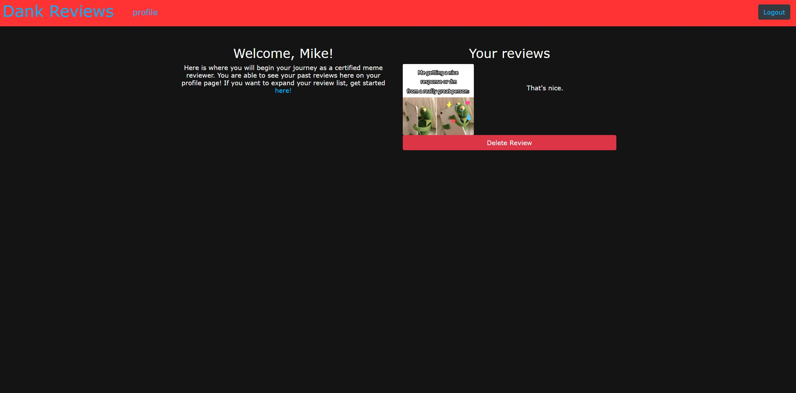

# Dank-Reviews

## Team

Mike Coletta - [MikeColetta](https://github.com/MikeColetta)

Debasu Eyasu - [bayleyegn100](https://github.com/bayleyegn100)

Haram Kwon - [kharam](https://github.com/kharam)

Parm Singh - [parmbir21](https://github.com/parmbir21)

Patrick Stutts - [PatrickStutts](https://github.com/PatrickStutts)

Jesse Willig - [jessewillig](https://github.com/jessewillig)

## Description

This website is created to have user review memes and give their inputs on the memes. You can only review memes if you have an account. Once you submit a review, you can view your reviews on your profile.

## User Story

As a user looking to review random memes

I want to find a random meme from reddit,

I also want to review that meme,

I also want that review saved to my profile,

So that I can look at my past reviews.
    
## Table of Contents
1. [Installation](#installation)
2. [Usage](#usage)
3. [License](#license)
4. [Questions](#questions)
5. [Credits](#credits)
    
## Installation
    
[Deployed Application](https://bootcamp-project2-uw.herokuapp.com)
    
## Usage

## License
    
MIT License
    
Copyright (c) 2021 The Dankest Meme-est
          
## Questions?
    
[Github]()
  
For any questions, please send me an [email](mailto:jdoe53736@gmail.com).